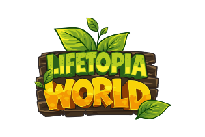

<div align="center">
  <a href="https://lifetopiaworld.io">
    
  </a>

  <h1>Lifetopia World Platform</h1>

  <p>
    A connected platform for a cozy social sandbox where gameplay,
    community, creativity, and optional digital ownership grow together.
  </p>

  <p>
    <a href="https://lifetopiaworld.io"><strong>Website</strong></a>
    ·
    <a href="https://community.lifetopiaworld.io"><strong>Community</strong></a>
    ·
    <a href="https://play.lifetopiaworld.io"><strong>Play Game</strong></a>
    ·
    <a href="https://docs.lifetopiaworld.io"><strong>Documentation</strong></a>
    ·
    <a href="https://grants.lifetopiaworld.io"><strong>Funding Hub</strong></a>
  </p>

  <p>
    
    
    
    
    
  </p>
</div>

---

## About Lifetopia World

**Lifetopia World** is a cozy life-simulation and social sandbox project
designed around relaxing gameplay, meaningful community interactions, player
identity, and an evolving digital society.

Players can explore a growing fantasy world, participate in activities, build
their player identity, connect with other Lifetopians, and follow the project's
development directly through its connected platform.

Solana-powered features are designed to support identity, digital ownership,
and the player economy without becoming a barrier to ordinary gameplay.

> [!IMPORTANT]
> Lifetopia World is currently in active **Beta development**.
> Some gameplay systems, integrations, and connected platform features are
> still being refined.

## Product Ecosystem

| Product | Purpose | Status |
| --- | --- | --- |
| [Official Website](https://lifetopiaworld.io) | Project introduction, gameplay information, roadmap, and public development updates | Live |
| [Community Platform](https://community.lifetopiaworld.io) | Discussions, social feed, player profiles, interactions, and My World | Beta |
| [Playable Game](https://play.lifetopiaworld.io) | Current playable Lifetopia World build | Beta / Maintenance |
| [Documentation](https://docs.lifetopiaworld.io) | Public product, technical, and development documentation | Live |
| [Funding Hub](https://grants.lifetopiaworld.io) | Project evidence, grant documents, milestones, and development transparency | Live |

## Product Vision

Lifetopia World is being built as more than a standalone game.

The long-term vision is to create a connected digital society where players
can build identities, form communities, explore the world, participate in an
economy, and contribute to the evolution of the ecosystem.

The product is organized around four main pillars.

### Cozy Gameplay

A welcoming life-simulation experience centered around activities such as
farming, fishing, exploration, quests, gathering, trading, social interaction,
and world progression.

### Community First

The community is part of the product itself, not only an external chat server.

Players can create profiles, publish posts, join discussions, interact with
other Lifetopians, and participate beyond the game client.

### Shared Player Identity

One Lifetopia account is designed to connect the official website, Community
Platform, game, marketplace, and future ecosystem products.

### Optional Web3

Blockchain features are intended to support ownership, identity, and the
player economy while keeping the ordinary player experience approachable.

## Current Development Phase

Lifetopia World has completed its initial concept, MVP, and Public Alpha
milestones.

The project is currently in the **Beta phase**, with development focused on:

- Strengthening the shared platform foundation
- Completing the Community Platform
- Improving account and player identity systems
- Expanding playable game systems
- Refining UI, visuals, and user experience
- Preparing deeper Solana integrations
- Improving project documentation and transparency
- Building a scalable foundation for future expansion

Completed milestones and historical builds are documented in the
[Development Journey](https://lifetopiaworld.io/#journey).

## Current Roadmap

### 01 — Community Platform Completion

Complete the shared social foundation where Lifetopians can connect, build
their identity, and participate beyond the game.

Key areas:

- Stable shared authentication and player profiles
- Community discussions and player interactions
- Notifications, discovery, and basic moderation
- Connected player identity
- Android application distribution preparation

### 02 — Playable Beta Expansion

Expand the playable world with deeper activities, progression, exploration,
and stronger social gameplay.

Key areas:

- Farming and fishing gameplay systems
- Town, park, and suburban locations
- Quest and player progression systems
- Multiplayer foundations
- Social gathering experiences
- Performance and gameplay polish

### 03 — Connected Solana Ecosystem

Connect player identity, wallets, digital ownership, and the early economy
through approachable Solana experiences.

Key areas:

- Community-to-game account synchronization
- Solana wallet integration foundation
- Devnet transaction testing
- Digital ownership experiments
- Marketplace foundation
- Player economy infrastructure

### 04 — World and Society Expansion

Grow Lifetopia into a broader living society through new places, social
systems, events, and player-driven experiences.

Future directions:

- Expanded world locations
- Additional gameplay activities
- Guilds and deeper social groups
- Seasonal events
- Community programs
- Android release
- Broader player distribution
- Player-driven economy expansion

## Platform Features

### Official Website

The official website introduces Lifetopia World and provides a central entry
point into the ecosystem.

Current website areas include:

- Project introduction
- Gameplay overview
- Community Platform introduction
- Development Journey
- Product roadmap
- Public Development Log
- Authentication entry points
- Connected ecosystem links

### Community Platform

The Community Platform combines forum functionality, social interactions, and
player identity.

Current features include:

- Public community feed
- Post creation
- Post editing and deletion
- Likes
- Comments
- Bookmarks
- Public player profiles
- Real player avatars
- Lifetopia-themed roles
- Shared authentication
- My World player dashboard
- Guest authentication flow

### Shared Authentication

The platform uses a shared account system intended to support the complete
Lifetopia ecosystem.

Current registration data includes:

- Username
- Display name
- Email
- Password
- Avatar
- Date of birth
- Country
- Gender

The same player identity is designed to work across the website, community,
game, marketplace, and future products.

### Public Development Log

Recent GitHub commits are synchronized into the official website to provide
verifiable public development updates.

The pipeline follows this flow:

```text
GitHub Push
    ↓
GitHub Actions
    ↓
Lifetopia Development Log API
    ↓
Supabase
    ↓
Public Development Log
```

View recent development activity:

- [Public Development Log](https://lifetopiaworld.io/#development-log)
- [GitHub Commit History](https://github.com/pashamuhammadd/lifetopia-platform/commits/main)

## Repository Scope

This repository contains the connected web platform and shared infrastructure
for Lifetopia World.

It includes:

- Official website
- Community Platform
- Funding Hub
- Shared authentication infrastructure
- Shared data and TypeScript definitions
- Supabase utilities
- Development Log pipeline
- Internal documentation tools
- Reusable UI and application services

The broader Lifetopia ecosystem also includes game development work using
Unity and Phaser.

Game-client source code, large game assets, and specialized game systems may
be maintained separately from this web-platform monorepo.

## Monorepo Structure

```text
lifetopia-platform/
├── apps/
│   ├── website/
│   │   └── Official Lifetopia World website
│   │
│   ├── community/
│   │   └── Community and player platform
│   │
│   └── grants/
│       └── Lifetopia World Funding Hub
│
├── packages/
│   ├── data/
│   │   └── Shared structured content
│   │
│   ├── devtools/
│   │   └── Internal project workflow tools
│   │
│   ├── eslint-config/
│   │   └── Shared ESLint configuration
│   │
│   ├── lib/
│   │   └── Supabase clients and shared utilities
│   │
│   ├── services/
│   │   └── Shared domain and application services
│   │
│   ├── types/
│   │   └── Shared TypeScript definitions
│   │
│   ├── typescript-config/
│   │   └── Shared TypeScript configuration
│   │
│   └── ui/
│       └── Shared UI components
│
├── public/
│   └── Shared public images and visual assets
│
├── package.json
├── pnpm-workspace.yaml
├── turbo.json
└── README.md
```

## Technology Stack

| Area | Technology |
| --- | --- |
| Web Framework | Next.js 16 |
| UI Library | React |
| Language | TypeScript |
| Styling | Tailwind CSS |
| Animation | Framer Motion |
| Monorepo | Turborepo |
| Package Manager | pnpm |
| Authentication | Supabase Auth |
| Database | Supabase PostgreSQL |
| Deployment | Vercel |
| Blockchain Ecosystem | Solana |
| Game Development | Unity and Phaser |
| Source Control | GitHub |
| Development Updates | GitHub Actions, API routes, and Supabase |

## Getting Started

### Prerequisites

Make sure the following tools are installed:

- Git
- Node.js
- pnpm

Check your installed versions:

```bash
node --version
pnpm --version
git --version
```

### Clone the repository

```bash
git clone https://github.com/pashamuhammadd/lifetopia-platform.git
cd lifetopia-platform
```

### Install dependencies

```bash
pnpm install
```

### Environment configuration

Each application requires valid environment variables.

Create the required local environment files for the application you want to
run.

Common locations include:

```text
apps/website/.env.local
apps/community/.env.local
apps/grants/.env.local
```

> [!CAUTION]
> Never commit private environment files, Supabase service-role keys, webhook
> secrets, private tokens, or production credentials.

### Start all applications

Run the root development command:

```bash
pnpm dev
```

### Start the official website

```bash
pnpm dev --filter=website
```

### Start the Community Platform

```bash
pnpm dev --filter=community
```

### Start the Funding Hub

```bash
pnpm dev --filter=grants
```

## Available Development Commands

### Root commands

```bash
pnpm dev
pnpm build
pnpm lint
pnpm check-types
```

Availability may depend on the scripts configured in the root
`package.json`.

### Website commands

```bash
pnpm --dir apps/website dev
pnpm --dir apps/website check-types
pnpm --dir apps/website lint
pnpm --dir apps/website build
```

### Community commands

```bash
pnpm --dir apps/community dev
pnpm --dir apps/community check-types
pnpm --dir apps/community lint
pnpm --dir apps/community build
```

### Funding Hub commands

```bash
pnpm --dir apps/grants dev
pnpm --dir apps/grants check-types
pnpm --dir apps/grants lint
pnpm --dir apps/grants build
```

## Internal Development Tools

The repository includes internal commands for maintaining project context,
documentation, and development status.

```bash
pnpm project:status
pnpm project:update
pnpm docs:generate
```

These tools help keep the following information synchronized:

- Project structure
- Application status
- Development progress
- Internal documentation
- Shared project context

## Quality Assurance

Before pushing production changes, validate the affected application.

For the official website:

```bash
pnpm --dir apps/website check-types
pnpm --dir apps/website lint
pnpm --dir apps/website build
```

For the Community Platform:

```bash
pnpm --dir apps/community check-types
pnpm --dir apps/community lint
pnpm --dir apps/community build
```

For the Funding Hub:

```bash
pnpm --dir apps/grants check-types
pnpm --dir apps/grants lint
pnpm --dir apps/grants build
```

For the complete monorepo:

```bash
pnpm build
```

## Development Workflow

A typical development workflow is:

```bash
git pull origin main
pnpm install
pnpm dev
```

After completing and validating a change:

```bash
git status
git add .
git commit -m "describe the completed change"
git push origin main
```

Recommended workflow principles:

1. Work on one product section or feature at a time.
2. Test changes locally.
3. Run type checking, linting, and production builds.
4. Review changed files before committing.
5. Use clear and descriptive commit messages.
6. Never commit secrets or local environment files.
7. Keep documentation synchronized with meaningful project changes.

## Architecture Principles

The platform follows several core engineering principles:

- Shared infrastructure across applications
- Reusable TypeScript definitions
- Centralized data and service layers
- Consistent authentication across subdomains
- Clear separation between applications and packages
- Accessible and responsive user experiences
- Public and verifiable development activity
- Scalable product foundations
- Secure handling of private credentials
- Documentation of meaningful technical decisions

## Security Notes

This repository may contain public application source code, but private
production credentials must never be committed.

Sensitive information includes:

- Supabase service-role keys
- Database credentials
- Webhook secrets
- Development Log API secrets
- Private access tokens
- Deployment credentials
- Local environment files
- Wallet private keys or seed phrases

Use environment variables for all private configuration.

## Deployment

The applications are deployed independently through Vercel.

| Application | Production Domain |
| --- | --- |
| Website | `lifetopiaworld.io` |
| Community | `community.lifetopiaworld.io` |
| Funding Hub | `grants.lifetopiaworld.io` |

Each Vercel project should use the appropriate application root directory:

```text
apps/website
apps/community
apps/grants
```

Production deployments are connected to the `main` branch.

## Development Principles

- Build for players first.
- Keep blockchain features approachable and optional.
- Treat the community as part of the product.
- Maintain one connected player identity.
- Prefer shared and reusable infrastructure.
- Publish verifiable development progress.
- Keep the product responsive and accessible.
- Document important product and architectural decisions.
- Protect private credentials and production infrastructure.
- Build a strong foundation before expanding complexity.

## Community

Join the Lifetopia World community and follow development updates.

| Channel | Link |
| --- | --- |
| Official Website | [lifetopiaworld.io](https://lifetopiaworld.io) |
| Community Platform | [community.lifetopiaworld.io](https://community.lifetopiaworld.io) |
| X / Twitter | [@LifetopiaWorld](https://x.com/LifetopiaWorld) |
| Discord | [Join the Lifetopia Discord](https://discord.gg/WeKtqJMcfb) |
| Telegram | [Lifetopia World Community](https://t.me/LifetopiaWorldCommunity) |
| Email | [contact@lifetopiaworld.io](mailto:contact@lifetopiaworld.io) |

## Studio

Lifetopia World is built by
[Nimia Games](https://nimiagames.com), an independent game and digital
entertainment studio focused on building connected interactive worlds.

## Project Leadership

Lifetopia World is founded and led by
[Pasha Muhammad](https://pashamuhammad.me).

The project is being developed with a focus on long-term product quality,
community participation, transparent progress, and sustainable ecosystem
growth.

---

<div align="center">
  <p>
    <strong>Play · Create · Connect</strong>
  </p>

  <p>
    Building a better world, together.
  </p>

  <p>
    © 2026 Lifetopia World. All rights reserved.
  </p>
</div>